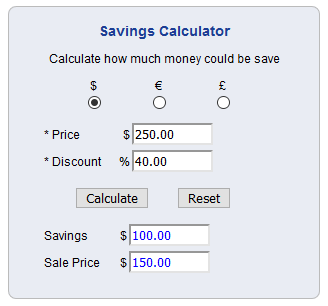

# Savings Calculator

This application calculates how much money could be saved. The user enters the price of the product
or service and the discount provided. The program then returns the savings and the sale price. This
is what the application looks like:

*The image above is a snapshot of what the application looks like when a user enters a price and a discount.*

Live Demo: https://stellagurin.github.io/Savings-Calculator/
